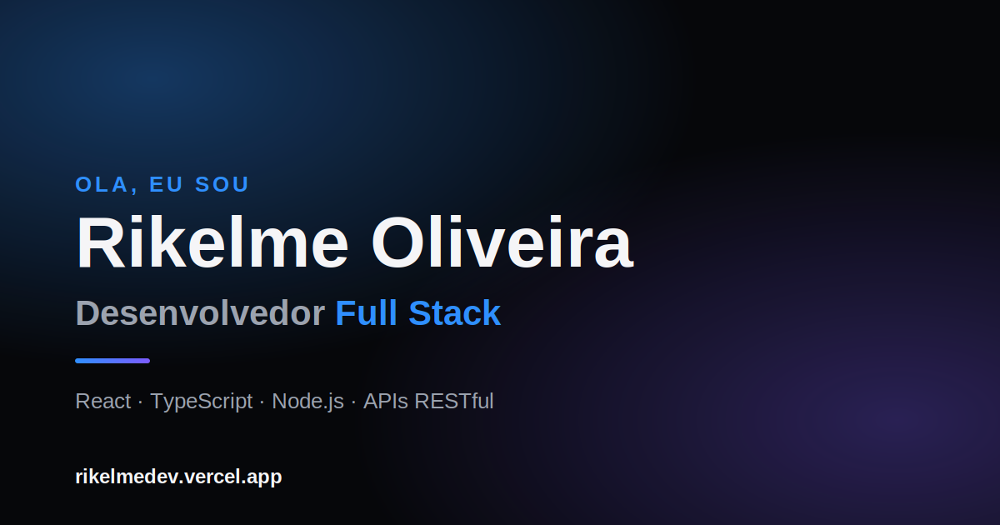

# Rikelme Oliveira — Portfólio

Portfólio pessoal de Rikelme Oliveira Gonçalves, Desenvolvedor Full Stack.

🔗 **Site ao vivo:** [rikelme-oliveira-dev.vercel.app](https://rikelme-oliveira-dev.vercel.app)

## Sobre

Site em página única apresentando trajetória profissional, stack técnica, formação e projetos reais, com foco em performance e visual moderno para recrutadores.

## Seções

- **Hero** — apresentação e chamadas para ação
- **Sobre** — resumo profissional e destaques
- **Skills** — stack técnica por categoria (Front-End, Back-End, Bases de Dados, Engenharia & DevOps)
- **Trajetória** — experiência profissional e formação acadêmica
- **Projetos** — cases reais com link para demo ao vivo ou repositório
- **Contato** — formulário que envia a mensagem direto via WhatsApp

## Tecnologias

- HTML5, CSS3 e JavaScript puro (sem frameworks ou build step)
- Animações de scroll reveal, parallax e transições em CSS/JS
- Deploy contínuo na [Vercel](https://vercel.com)
